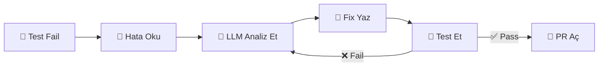

# 🧬 Self-Healing Code Agent

**Test patladı → Agent fix'ledi → PR açtı → Testler geçti. İnsan müdahalesi: 0.**

CI/CD pipeline'ında test fail olduğunda otomatik olarak hatayı tespit eden, analiz eden, düzelten ve PR açan otonom AI agent.

---

## 🎬 Demo

```
❌ Test Failed: test_login (auth.py, line 42)
🔍 Agent analyzing...
🧠 Root cause: NoneType check missing
🔧 Fix generated → PR #127 opened
✅ All tests passed. Auto-merged.
⏱️ 47 seconds. Human intervention: 0.
```

---

## 🏗️ Nasıl Çalışıyor?



Agent bir **ReAct döngüsü** kullanıyor: Düşün → Yap → Gözlemle → Tekrar et. Fix çalışmazsa kendini düzeltip tekrar deniyor.

---

## 📂 Proje Yapısı

| Modül | Görevi |
|-------|--------|
| `watcher/` | CI/CD'yi dinler, test failure yakalar |
| `analyzer/` | Hata mesajını parse eder (dosya, satır, hata türü) |
| `reasoner/` | LLM ile root cause bulur, fix planlar |
| `patcher/` | Kodu düzenler, diff üretir |
| `validator/` | Testleri çalıştırıp fix'i doğrular |
| `merger/` | Branch açar, PR oluşturur, merge eder |

---

## 🛠️ Tech Stack

- **AI:** OpenAI GPT-4o / LangGraph (agent framework)
- **Git:** PyGithub + GitPython
- **Code Analysis:** Python AST + tree-sitter
- **API:** FastAPI (webhook listener)
- **Test:** pytest

---

## 🚀 Kurulum

```bash
git clone https://github.com/EnesKok20/self-healing-agent.git
cd self-healing-agent
pip install -r requirements.txt
cp .env.example .env   # API key'leri düzenle
python main.py --repo /path/to/project --watch
```

---

## 🗺️ Yol Haritası

- [x] Proje yapısı ve dokümantasyon
- [ ] Error parser (hata analizi)
- [ ] LLM entegrasyonu (ReAct loop)
- [ ] Code patcher (otomatik fix)
- [ ] Test validator
- [ ] Git PR otomasyonu
- [ ] Web dashboard
- [ ] Multi-language desteği

---

## 🧑‍💻 Geliştirici Yolculuğum

```
📊 ML Temelleri → Titanic, California Housing
🧠 Deep Learning → CNN, PyTorch
📝 NLP → Sentiment Analysis (ML vs CNN vs LLM)
🤖 LLM + RAG → Embedding + Retrieval sistemi
🛠️ AI Agent → Tool-calling, ReAct pattern
🧬 Self-Healing Agent → Bu proje ★
```

---

## 📜 Lisans

MIT License — serbestçe kullanabilirsiniz.

<p align="center">
  <b>Built by <a href="https://github.com/EnesKok20">Enes Kok</a></b><br>
  <i>AI Agent Developer • Software Engineering Student</i>
</p>
